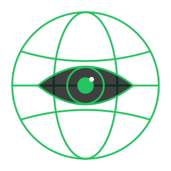

<div align="center">


[](https://git.io/typing-svg)

<br>

[](#-ls---core)
[](#-stats---live)
[](#-cat-feedstxt)
[](#-refresh)

[](https://github.com/Ringmast4r/Gods-Eye-Index/stargazers)
[](https://github.com/Ringmast4r/Gods-Eye-Index/network/members)
[](#)
[](https://github.com/Ringmast4r/Gods-Eye-Index/commits/main)
[](#)



</div>

---

## `> what_is_this`

```bash
you@github:~$ cat gods-eye-index.txt

  PURPOSE:        One list of every "God's Eye" style live world-map / intel dashboard on GitHub
  TRACKED:        15 projects (3 core, 12 downstream), 3 namesakes flagged
  COMBINED:       114,750 stars across the tracked set
  FEEDS:          29 shared upstream data sources, 20 of them keyless
  SOURCE:         data/projects.db is the truth; README is generated from it
  REFRESHED:      2026-09-09 06:03 UTC
  STATUS:         [ ACTIVE ]
```

> In August 2026 "spy satellite simulator in your browser" repos took over GitHub Trending. This index tracks them in one place, with live stars, what each one actually does, what it is built on, and which upstream feeds they all share, so the list stays useful after the hype cycle moves on.

---

## `> stats --live`

<div align="center">

| # | PROJECT | STARS | FORKS | ISSUES | LICENSE | LANG | PUSHED | STATUS |
|:-:|:--------|------:|------:|-------:|:-------:|:----:|:------:|:------:|
| 1 | [World Monitor](https://github.com/koala73/worldmonitor) | `85,870` | `12,978` | `285` | AGPL-3.0 | TypeScript | 2026-09-09 | `active` |
| 2 | [God's Eye View](https://github.com/bilawalsidhu/gods-eye-view) | `19,821` | `4,055` | `144` | MIT (code) | JavaScript | 2026-09-05 | `active` |
| 3 | [OSIRIS](https://github.com/simplifaisoul/osiris) | `8,964` | `1,835` | `9` | MIT | TypeScript | 2026-09-09 | `active` |
| 4 | [Godseye 1.0](https://github.com/VrushankPatel/godseye) | `40` | `18` | `0` | Apache-2.0 | JavaScript | 2026-07-05 | `quiet` |
| 5 | [God's Eye (noaRoblesLevy)](https://github.com/noaRoblesLevy/GodsEye) | `14` | `8` | `0` | none | JavaScript | 2026-03-05 | `stale` |
| 6 | [City Monitor](https://github.com/OdinMB/city-monitor) | `7` | `4` | `9` | AGPL-3.0 | TypeScript | 2026-09-04 | `active` |
| 7 | [Sphere](https://github.com/AnishNehete/TheSphere) | `4` | `0` | `5` | none | Python | 2026-04-29 | `stale` |
| 8 | [osint-worldmap](https://github.com/noaRoblesLevy/osint-worldmap) | `0` | `0` | `0` | none | TypeScript | 2026-02-28 | `stale` |
| 9 | [World Monitor (tncsharetool)](https://github.com/tncsharetool/worldmonitor) | `9` | `1` | `1` | AGPL-3.0 | TypeScript | 2026-03-05 | `stale` |
| 10 | [Atlas Watchtower](https://github.com/meet-the-1337/AtlasWatchtower) | `4` | `0` | `0` | AGPL-3.0 | TypeScript | 2026-08-10 | `active` |
| 11 | [World Monitor Enhanced](https://github.com/sjkncs/worldmonitor-enhanced) | `4` | `2` | `0` | AGPL-3.0 | TypeScript | 2026-03-04 | `stale` |
| 12 | [Worldcast](https://github.com/wilson-cheng1110/WorldPredict) | `4` | `0` | `0` | AGPL-3.0 | JavaScript | 2026-05-11 | `stale` |
| 13 | [WorldMonitor CYD Edition](https://github.com/dagnazty/WorldMonitor_CYD) | `3` | `1` | `0` | MIT | C | 2026-04-10 | `stale` |
| 14 | [worldview (shawn14)](https://github.com/shawn14/worldview) | `3` | `2` | `0` | none | TypeScript | 2026-03-03 | `stale` |
| 15 | [World Monitor Pro](https://github.com/worldmonitor-app/worldmonitor) | `3` | `3` | `0` | MIT | TypeScript | 2026-07-13 | `quiet` |

</div>

`active` = pushed in the last 30 days, `quiet` = 120, `stale` = older. 5 of 15 are active as of 2026-09-09.

---

## `> ls --core`

The three that blew up. Everything else in this list is downstream of one of them.

### [World Monitor](https://github.com/koala73/worldmonitor)

`85,870 stars` · `AGPL-3.0` · `TypeScript` · `pushed 2026-09-09` · `active` · [worldmonitor.app](https://worldmonitor.app)

**The reference project: 500+ news feeds, 56 layer types, AI briefs, dual globe/flat engine, Tauri desktop, MCP server + REST + SDKs.**

Started January 2026 as one developer's personal dashboard and became the biggest project in the category. Vanilla TypeScript + Vite; globe.gl/Three.js for the 3D globe and deck.gl/MapLibre for the flat map, sharing one layer catalog. Ingests 500+ curated RSS feeds across 15 categories and synthesizes them into AI briefs (Ollama locally, or Groq/OpenRouter; Transformers.js in the browser for classification). Adds a Country Instability Index for 31 Tier-1 countries, a 7-signal finance radar, cross-stream correlation (military + market + disaster signals converging), six site variants (world, tech, finance, commodity, happy, energy) from one codebase, a Tauri 2 desktop app, and a programmatic surface: MCP server, REST API, npm CLI, Python/Ruby/Go SDKs. Flights come from Wingbits. Deploys to Vercel Edge with Upstash Redis and a 3-tier cache. Paid Pro tier gates API keys, longer history and premium layers.

| | |
|:--|:--|
| **Engine** | globe.gl + Three.js (3D), deck.gl + MapLibre GL (flat) |
| **Basemap** | vector tiles |
| **Backend** | Vercel Edge Functions, Railway relay, Upstash Redis |
| **Stores history** | no (Pro tier sells longer history) |
| **Keyless start** | yes, runs with no env vars |
| **Layers** | news (500+ feeds), conflicts, military + civil aviation, maritime AIS, undersea cables, infrastructure, markets / crypto / commodities, climate hazards, cyber signals, CII risk scores |
| **Keys** | none required; ACLED, Groq/OpenRouter and other feature keys optional; Pro key for MCP tools/call |
| **Weak spots** | keys reset on exit (desktop); Node sidecar missing on some machines breaks panels; Linux black screen; layout shift on load; browser T5 summaries unreliable; ACLED token rejections; Pro paywall creep |

### [God's Eye View](https://github.com/bilawalsidhu/gods-eye-view)

`19,821 stars` · `MIT (code)` · `JavaScript` · `pushed 2026-09-05` · `active` · [maptheworld.ai](https://maptheworld.ai/)

**The cinematic one: CesiumJS + Google Photorealistic 3D Tiles, cockpit ride-alongs, FLIR/NVG sensor modes, voice agent. Keyless start on Esri imagery.**

Bilawal Sidhu's "spy satellite simulator in your browser, except the data is real." Vanilla JavaScript + Vite on CesiumJS: Google Photorealistic 3D Tiles when you bring a key, Esri World Imagery + Re:Earth terrain when you don't. Hit #1 on GitHub Trending in August 2026 after the MIT release. Live layers: flights (OpenSky with an adsb.lol fallback), military tracks (adsb.lol), vessels (AISStream key), satellites (CelesTrak + SGP4), earthquakes (USGS), traffic simulated along real OSM roads (TomTom optional), public CCTV (Austin, Caltrans, TfL), internet radio, bikeshare (GBFS), active fires (FIRMS key), launches (Launch Library 2). Bundled static data: ~4.3k datacenters, 704 dams, TeleGeography submarine cables (CC BY-NC-SA, carved out of the MIT license). Signature features: ride inside any tracked flight with the terrain held under you, a 250 km contacts roster, sensor styles, and voice control via the OpenAI Realtime API. Private keys route through a hardened server-side proxy with SSRF protection and per-provider budgets. No persistence at all; the README says it outright: "the present is the cheap part. The moment you try to go back in time the data gets expensive." Requires Node 24.14+ or 26.

| | |
|:--|:--|
| **Engine** | CesiumJS |
| **Basemap** | Google Photorealistic 3D Tiles (key) or Esri World Imagery (keyless) |
| **Backend** | Vite dev server + Node proxy for keyed providers |
| **Stores history** | no |
| **Keyless start** | yes (Esri imagery; flights, mil, sats, quakes, cams, radio, launches all keyless) |
| **Layers** | flights, military flights, vessels, satellites, earthquakes, traffic, CCTV, radio, bikeshare, fires, launches, datacenters, dams, submarine cables |
| **Keys** | none to start; optional Cesium ion, Google Maps, AISStream, FIRMS, TomTom, OpenAI, LL2 token |
| **Weak spots** | Google 3D unavailable in some regions (EEA); key setup confusion; npm install failures from the Node 24 floor; "AI slop" complaints about the volume of generated docs and QA scripts; no place search without a Google key; no weather layer |

### [OSIRIS](https://github.com/simplifaisoul/osiris)

`8,964 stars` · `MIT` · `TypeScript` · `pushed 2026-09-09` · `active` · [osirisai.live](https://osirisai.live)

**Next.js 16 + MapLibre "Palantir alternative": 16 layers plus a RECON toolkit (port scan, WHOIS, CVE, crypto wallet + OFAC checks) and Telegram geoparsing.**

Open Source Intelligence & Reconnaissance Integrated System. Next.js 16 + TypeScript with MapLibre GL rendering every entity through WebGL. Layers: OpenSky aviation split into commercial / private / military, 17,000+ CCTV cameras (TfL, WSDOT, Caltrans, ODOT, MDOT, Hong Kong, Taiwan, NZTA), USGS quakes, FIRMS fires, NASA EONET severe events, NOAA SWPC + N2YO space, NVD CVEs, 25+ live 24/7 broadcaster streams pinned to the map, 39 ports and 10 chokepoints as static maritime intel, 13 hand-curated conflict zones, and a Telegram layer that scrapes public t.me/s/ previews and geoparses posts in English, Cyrillic and Arabic. The RECON toolkit is the differentiator: TCP port scanner, DNS, WHOIS, SSL inspector, IP intel, CVE lookup, BTC/ETH wallet tracing with OFAC SDN cross-checks via OpenSanctions. Polling was relaxed to 15-30 minute intervals to cut Vercel edge requests by 75%. The repo description embeds a pump.fun token address, so there is a memecoin attached.

| | |
|:--|:--|
| **Engine** | MapLibre GL (WebGL) |
| **Basemap** | vector tiles |
| **Backend** | Next.js API routes as proxies, in-memory caches |
| **Stores history** | no |
| **Keyless start** | mostly; OpenSky anonymous, FIRMS and N2YO need keys |
| **Layers** | aviation, CCTV, earthquakes, fires, news streams, weather events, space weather + satellites, CVEs, conflict zones (static), ports + chokepoints (static), crypto/sanctions, Telegram posts |
| **Keys** | FIRMS, N2YO; OpenSky optional; everything else keyless |
| **Weak spots** | conflict zones and maritime are hand-typed lists, not feeds; memecoin attached to the project; edge-request costs drove slow polling |

---

## `> ls --small-builds`

Independent builds worth reading. Smaller, but each does one thing the big three do not.

### [Godseye 1.0](https://github.com/VrushankPatel/godseye)

`40 stars` · `Apache-2.0` · `JavaScript` · `pushed 2026-07-05` · `quiet` · [godseye-x.web.app](https://godseye-x.web.app/)

**Frontend-only React + CesiumJS BYOK globe with the longest layer list of the small builds: buoys, METAR, SIGMET, aurora, Wikidata conflicts, DOE outages.**

React + Vite + CesiumJS + Tailwind + Zustand, no backend at all: every feed is fetched from the browser, so keyed sources need your own keys in a local secrets file. Inspired by Bilawal's WorldView write-up. Layers beyond the usual flights / satellites / quakes / CCTV: GDACS disaster alerts, EONET hazards, IRIS seismic stations, OurAirports, WFP ports + AISstream vessels, DOE ODIN outages + WRI power plants, NWS alert polygons, NDBC ocean buoys, Smithsonian volcanic activity, SWPC aurora and GOES flares, METAR flight categories, AIRMET/SIGMET hazard polygons, Open-Meteo weather and AQI grids, Wikidata SPARQL armed conflicts, military bases (NTAD + OSM), restricted airspace. Vision modes: NVG, FLIR, CRT, Anime, God Mode. The author notes Codex was used for scaffolding. Hosted at godseye-x.web.app.

| | |
|:--|:--|
| **Engine** | CesiumJS |
| **Basemap** | Google 3D Tiles (BYOK) or Cesium default |
| **Backend** | none (browser fetch only) |
| **Stores history** | no |
| **Keyless start** | partial; keyed layers stay empty |
| **Layers** | 30+ toggles, see overview |
| **Keys** | BYOK: Google 3D, YouTube, Guardian, AISStream, FIRMS |
| **Weak spots** | browser-direct fetches hit CORS and rate limits; hosted build depends on the author's keys |

### [God's Eye (noaRoblesLevy)](https://github.com/noaRoblesLevy/GodsEye)

`14 stars` · `none` · `JavaScript` · `pushed 2026-03-05` · `stale`

**Early CesiumJS + Google 3D Tiles clone with NVG/FLIR/CRT/Anime shaders and a God Mode; successor to osint-worldmap; dead since March 2026.**

One of the first public clones of Bilawal's original WorldView demo, built before God's Eye View itself was open-sourced. CesiumJS with Google Photorealistic 3D Tiles (falls back to NASA Blue Marble), CelesTrak satellites via SGP4, OpenSky aircraft, Austin traffic cameras, simulated traffic particles on OSM streets, and Canvas2D post-processing shaders. Seven source files, no backend, no license file. Its predecessor osint-worldmap is a TypeScript version of the same idea. Last commit 2026-03-05.

| | |
|:--|:--|
| **Engine** | CesiumJS |
| **Basemap** | Google 3D Tiles or NASA Blue Marble |
| **Backend** | none |
| **Stores history** | no |
| **Keyless start** | partial |
| **Layers** | satellites, aircraft, CCTV (Austin), simulated traffic |
| **Keys** | Google Maps (optional), Cesium ion |
| **Weak spots** | abandoned; no license |

### [City Monitor](https://github.com/OdinMB/city-monitor)

`7 stars` · `AGPL-3.0` · `TypeScript` · `pushed 2026-09-04` · `active` · [citymonitor.app](https://citymonitor.app)

**World Monitor scaled down to one city (Berlin): cron ingest into PostgreSQL, pre-built JSON, React + MapLibre. The only one here that actually stores data.**

A city-scale take: weather, transit disruptions, news, events, police reports, air quality, wastewater virus measures, water levels, pharmacies, traffic, construction. What makes it worth reading for anyone building their own is the architecture: Node/Express cron jobs ingest feeds on a schedule into PostgreSQL (Drizzle ORM) and serve pre-built JSON to a React 19 + MapLibre SPA. GPT-5 for news summaries. Turborepo monorepo. Live at citymonitor.app and still active.

| | |
|:--|:--|
| **Engine** | MapLibre GL |
| **Basemap** | vector tiles |
| **Backend** | Express + node-cron + PostgreSQL |
| **Stores history** | yes (PostgreSQL) |
| **Keyless start** | needs a DATABASE_URL |
| **Layers** | weather, transit, news, events, police, air quality, wastewater, water, pharmacies, traffic, construction |
| **Keys** | PostgreSQL, OpenAI for summaries |
| **Weak spots** | single city; Render.com deploy |

### [Sphere](https://github.com/AnishNehete/TheSphere)

`4 stars` · `none` · `Python` · `pushed 2026-04-29` · `stale` · [thesphere.icu](https://thesphere.icu/)

**Search-first "why is X happening" platform on a photorealistic globe: entity resolution, scoped evidence, causal chain, portfolio impact.**

Python full-stack that treats the globe as the front door to an investigation loop: ask a question ("Why is TSLA down?", "Compare Japan vs Korea"), resolve the entity, retrieve scoped evidence, explain the cause, show market and portfolio impact, save and share. A different goal from the map-first projects: the map is context, the answer is the product. Two days of commits in April 2026, no license.

| | |
|:--|:--|
| **Engine** | photorealistic 3D globe (see repo) |
| **Basemap** | - |
| **Backend** | Python |
| **Stores history** | investigations are saved |
| **Keyless start** | no |
| **Layers** | signals, markets, news, weather, conflict as evidence sources |
| **Keys** | LLM + market data keys |
| **Weak spots** | two-day project; no license |

### [osint-worldmap](https://github.com/noaRoblesLevy/osint-worldmap)

`0 stars` · `none` · `TypeScript` · `pushed 2026-02-28` · `stale`

**The TypeScript predecessor of noaRoblesLevy/GodsEye. Satellites, ships, planes on a world map.**

Two-day project from late February 2026 that became GodsEye a week later. Kept here only so the lineage is complete.

| | |
|:--|:--|
| **Engine** | - |
| **Basemap** | - |
| **Backend** | none |
| **Stores history** | no |
| **Keyless start** | - |
| **Layers** | satellites, ships, planes |
| **Keys** | - |
| **Weak spots** | abandoned |

---

## `> ls --derivatives`

Forks, ports, rebrands and bridges of World Monitor and God's Eye View.

### [World Monitor (tncsharetool)](https://github.com/tncsharetool/worldmonitor)

`9 stars` · `AGPL-3.0` · `TypeScript` · `pushed 2026-03-05` · `stale` · [breaths.me](https://breaths.me)

**World Monitor re-upload pitched as an "MMO-like world map" creators can monetize with affiliate flows and ad networks; 1,700-line README.**

A March 2026 copy of World Monitor whose README was rewritten around monetization: affiliate flows, ad networks, community hosting. Same code, different pitch. Points at breaths.me.

### [Atlas Watchtower](https://github.com/meet-the-1337/AtlasWatchtower)

`4 stars` · `AGPL-3.0` · `TypeScript` · `pushed 2026-08-10` · `active` · [atlas-watchtower.vercel.app](https://atlas-watchtower.vercel.app)

**World Monitor rebrand with desktop builds and "30+ sources"; one push in August 2026.**

A renamed World Monitor (the README still opens with "WorldMonitor is..."). Same feature set: earthquakes, fires, military and commercial flights, AIS, 100+ RSS feeds with AI clustering, markets / crypto / prediction markets, cyber threat indicators, internet outage mapping, country instability scoring. Ships web, PWA and Windows / macOS / Linux desktop. Created and last pushed on the same day, 2026-08-10.

### [World Monitor Enhanced](https://github.com/sjkncs/worldmonitor-enhanced)

`4 stars` · `AGPL-3.0` · `TypeScript` · `pushed 2026-03-04` · `stale`

**World Monitor copy with bolted-on "quant trading AI (75-85% accuracy)," 10-second military tracking and energy alerts. Treat the accuracy claims as marketing.**

A World Monitor snapshot from March 2026 with three add-ons documented in Chinese: a FinBERT + LSTM + GARCH trading signal generator, OpenSky military tracking at 10-second refresh with 6-hour trajectory prediction, and an energy-intelligence alert layer. One day of commits.

### [Worldcast](https://github.com/wilson-cheng1110/WorldPredict)

`4 stars` · `AGPL-3.0` · `JavaScript` · `pushed 2026-05-11` · `stale` · [wilson-cheng1110.github.io/WorldPredict](https://wilson-cheng1110.github.io/WorldPredict)

**Bridges World Monitor with the MiroFish multi-agent simulator: pick a live event, simulate downstream effects, get notified when reality matches.**

Pick any event on the World Monitor globe, click "Predict this event," and MiroFish spawns thousands of AI agents with memory and personality to simulate what happens next across markets, geopolitics and supply chain. It then emits a checklist of verifiable watch signals and keeps scanning incoming World Monitor events; when one matches, you get a browser notification. Runs against included mocks without Docker. AGPL, last pushed 2026-05-11.

### [WorldMonitor CYD Edition](https://github.com/dagnazty/WorldMonitor_CYD)

`3 stars` · `MIT` · `C` · `pushed 2026-04-10` · `stale`

**World Monitor Desktop Companion ported to a $15 ESP32 Cheap Yellow Display.**

Complete port of the World Monitor companion to the 2.8-inch ESP32 CYD touchscreen: Yahoo Finance indices / VIX / yields, USGS earthquakes, NASA EONET events, plus mock risk scores and news. Touch navigation, kiosk auto-advance, WiFi config stored in flash. Arduino / PlatformIO with TFT_eSPI. MIT.

### [worldview (shawn14)](https://github.com/shawn14/worldview)

`3 stars` · `none` · `TypeScript` · `pushed 2026-03-03` · `stale`

**Next.js spy-satellite-sim clone from March 2026 with the untouched create-next-app README. Dead.**

CesiumJS + Google 3D Tiles + live aircraft / satellites + military-style visual filters, per the description. The README is still the Next.js boilerplate. Two days of commits.

### [World Monitor Pro](https://github.com/worldmonitor-app/worldmonitor)

`3 stars` · `MIT` · `TypeScript` · `pushed 2026-07-13` · `quiet`

**Marketing repo for the paid World Monitor Pro tier (equity research, AI morning briefs, 100+ connectors); little code of its own.**

Describes the Pro upsell: equity research, geopolitical frameworks, central bank tracking, AI morning briefs to Slack / Telegram / WhatsApp, satellite imagery and SAR, 50,000+ mapped infrastructure assets, 100+ enterprise connectors. Useful only as a map of where the upstream project is heading commercially.

---

## `> ls --not-these`

Same name, different thing. Listed so the search results make sense.

| REPO | WHAT IT ACTUALLY IS |
|:-----|:--------------------|
| [KamalDevelopers/GodsEyeView](https://github.com/KamalDevelopers/GodsEyeView) | A hobby operating system that shows up first when you search the name. |
| [LeonardoCides/God-s-eye](https://github.com/LeonardoCides/God-s-eye) | Username enumeration across social platforms. Same name, not a map. |
| [Shajal-Kumar/Gods-Eye](https://github.com/Shajal-Kumar/Gods-Eye) | Human-in-the-loop OSINT framework. Same name, not a map. |

## `> diff --core`

| | **World Monitor** | **God's Eye View** | **OSIRIS** |
|:--|:--|:--|:--|
| Engine | globe.gl + Three.js (3D), deck.gl + MapLibre GL (flat) | CesiumJS | MapLibre GL (WebGL) |
| Basemap | vector tiles | Google Photorealistic 3D Tiles (key) or Esri World Imagery (keyless) | vector tiles |
| Backend | Vercel Edge Functions, Railway relay, Upstash Redis | Vite dev server + Node proxy for keyed providers | Next.js API routes as proxies, in-memory caches |
| Stores history | no (Pro tier sells longer history) | no | no |
| Keyless start | yes, runs with no env vars | yes (Esri imagery; flights, mil, sats, quakes, cams, radio, launches all keyless) | mostly; OpenSky anonymous, FIRMS and N2YO need keys |
| License | AGPL-3.0 | MIT (code) | MIT |
| Stars | `85,870` | `19,821` | `8,964` |
| Signature | AI briefs + CII + MCP/SDKs | cockpit view + 3D tiles + voice | RECON toolkit + Telegram + OFAC |

**What none of them do:** keep history you own (every one is a live snapshot; God's Eye View's README says going back in time is "the expensive part"), show per-layer provenance and freshness on the map, or run fully self-hosted without a cloud edge / Redis / third-party key chain. City Monitor is the only one that writes to a database. Those gaps are the spec for the next one.

---

## `> cat feeds.txt`

The upstream sources the whole category is built on. Same feeds, different chrome.

| FEED | DOMAIN | KEY | USED BY |
|:-----|:-------|:----|:--------|
| [Google Photorealistic 3D Tiles](https://developers.google.com/maps/documentation/tile) | 3D basemap | metered key | GEV, GSE, NGE |
| [NVD](https://nvd.nist.gov/developers) | CVEs | none (rate-limited) | OSR |
| [NWS api.weather.gov](https://api.weather.gov/alerts/active) | US weather alerts | none (User-Agent required) | GSE |
| [NASA FIRMS](https://firms.modaps.eosdis.nasa.gov/api/) | active fires | free MAP_KEY | GEV, OSR, GSE |
| [GBFS](https://gbfs.org) | bikeshare | none | GEV |
| [ACLED](https://acleddata.com) | conflict events | registration key | WM |
| [GDACS](https://www.gdacs.org/gdacsapi/api/events/geteventlist/MAP) | disaster alerts | none | GSE, OSR |
| [USGS](https://earthquake.usgs.gov/earthquakes/feed/v1.0/summary/2.5_day.geojson) | earthquakes | none | all |
| [OpenSky Network](https://opensky-network.org/api/states/all) | flights | none (anon, rate-limited; non-commercial license) | WM, GEV, OSR, GSE, NGE |
| [Wingbits](https://wingbits.com) | flights | partner | WM |
| [adsb.lol](https://api.adsb.lol/v2/mil) | flights + military | none (ODbL) | GEV |
| [GDELT](https://api.gdeltproject.org/api/v2/geo/geo) | geo-tagged news | none | GEV (fallback), OSR |
| [Radio Browser](https://api.radio-browser.info) | internet radio | none | GEV |
| [Launch Library 2](https://ll.thespacedevs.com/2.3.0/launches/upcoming/) | launches | none (15/hr anon) or token | GEV |
| [NASA EONET](https://eonet.gsfc.nasa.gov/api/v3/events?status=open) | natural events | none | OSR, GSE, CYD |
| [NOAA NDBC](https://www.ndbc.noaa.gov/) | ocean buoys | none | GSE |
| [City CCTV (Austin, Caltrans, TfL, WSDOT...)](https://api.tfl.gov.uk) | public cameras | none | GEV, OSR, GSE, NGE |
| [OpenStreetMap Overpass](https://overpass-api.de) | roads, military sites | none (ODbL) | GEV, GSE |
| [OpenSanctions](https://www.opensanctions.org) | sanctions (OFAC SDN) | none (CC-BY) | OSR |
| [Esri World Imagery](https://services.arcgisonline.com/ArcGIS/rest/services/World_Imagery/MapServer) | satellite basemap | none | GEV |
| [N2YO](https://www.n2yo.com/api/) | satellites | free key | OSR |
| [CelesTrak](https://celestrak.org/NORAD/elements/gp.php?GROUP=active&FORMAT=json) | satellites (TLE) | none | GEV, GSE, NGE |
| [NOAA SWPC](https://services.swpc.noaa.gov/products/noaa-planetary-k-index.json) | space weather | none | OSR, GSE |
| [TeleGeography](https://www.submarinecablemap.com) | submarine cables | bundled (CC BY-NC-SA) | GEV, WM |
| [Cesium ion](https://ion.cesium.com) | terrain / 3D | free token | GEV, NGE |
| [TomTom Traffic](https://developer.tomtom.com) | traffic flow | free key (200k tiles/mo) | GEV |
| [OpenFreeMap](https://tiles.openfreemap.org/styles/positron) | vector basemap | none | - |
| [AISStream.io](https://aisstream.io) | vessels (AIS) | free key | GEV, GSE |
| [Open-Meteo](https://open-meteo.com) | weather / AQI | none | GEV, GSE |

WM = World Monitor, GEV = God's Eye View, OSR = OSIRIS, GSE = Godseye 1.0, NGE = noaRoblesLevy/GodsEye, CYD = WorldMonitor CYD

---

## `> refresh`

```bash
python scripts/seed.py           # rebuild tables from the curated lists in seed.py
python scripts/refresh.py        # live stars / forks / license / pushed_at via gh api
python scripts/build_readme.py   # regenerate this README from data/projects.db
```

Add a project: append a dict to `PROJECTS` in `scripts/seed.py`, run the three commands, commit. Never hand-edit the `.db` or this README.

---

## `> tree`

```
Gods-Eye-Index/
├── README.md              generated, do not edit
├── assets/logo.svg
├── data/projects.db       source of truth (projects, feeds, meta)
└── scripts/
    ├── seed.py            curated lists -> db
    ├── refresh.py         gh api -> live stats
    └── build_readme.py    db -> README.md
```

---

<div align="center">

**Maintained by** [@Ringmast4r](https://github.com/Ringmast4r) · stats via `gh api`, refreshed 2026-09-09 06:03 UTC


</div>
